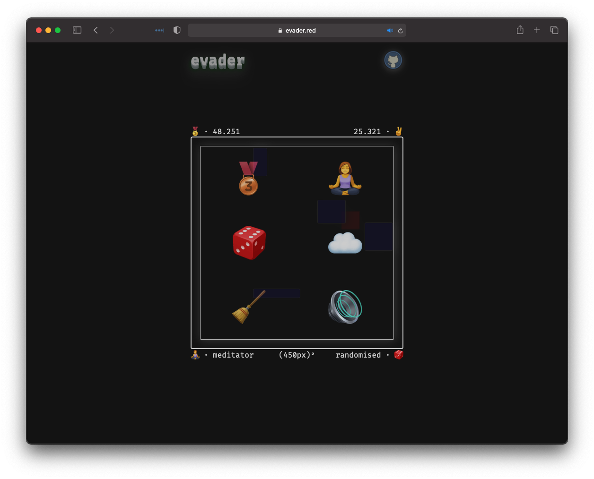
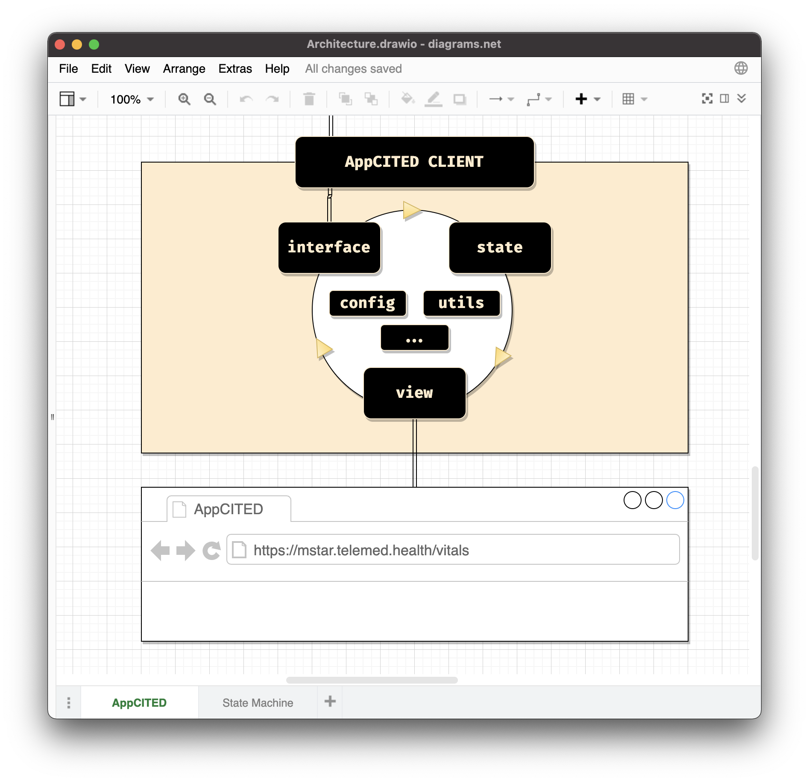

# evader

**evader** is a minimal game about evading oncoming obstacles in a constricted area. You can play the game -- [here](https://fatman-.github.io/evader/). Hope you have fun!

  

## History and Motivation

**evader** started its journey as an educational aid, to teach module-oriented interactive UI architecture; over the course of its development, it became its own thing. Going even further back in time...

Sometime around 1999-2001, someone created a minimal game called **Escapa** using the WYSIWYG web page maker called Microsoft Frontpage. The time of its origin is a pure guess based on the Frontpage's version present in a meta tag in the game's HTML.

The game found its way to me in 2010, via an email chain with an urban legend-esque story, that it was used by US Air Force pilots to train their focus. I had a lot of fun playing the game then, and competing with my friends for the best scores. Following is a screenshot of an instance of **Escapa**.

  

Cut to present day (2021) -- I am demonstrating the architectural principles of writing modular and interactive client-facing software using Vanilla JavaScript to a few frontend juniors in the company that I work at.

In our case, this is an interactive client which talks to smart telemed devices, and displays metrics -- vitals, and such -- in realtime (these metrics are further relayed to a remote doctor).

  

Unfortunately that codebase is closed-source, and there was a lot of friction in sharing it as an example even with other groups in the company, who could have definitely benefited from such a resource.

...and then, I remembered **Escapa**. The plan was to rewrite it using above principles, and have it on display for whoever was interested. That's how **evader** was born.

As I've mentioned previously, over time **evader** turned into its own thing. Along with the improved aesthetics and the structured codebase, it has new game mechanics -- two different game modes; a game randomiser (enemy positions, and speeds); and additional bells and whistles -- locally-persisted stats, audio/visual themes, etc...

## Acknowledgements

I would be amiss if I didn't mention the people, and resources whose help has been invaluable in building **evader**.

I am thankful to [Nikhil Astakala](https://github.com/nikhilism15) and [Sai Somanath Komanduri](https://github.com/saisk8) for their inputs on certain game mechanics, and for being such ardent testers of the game.

The game's aesthetic value is majorly because of

-   the emojis, designed by Facebook;
-   the ethereal soundtrack, composed by [Chris Zabriskie](https://chriszabriskie.bandcamp.com/);
-   the sound effects from freesound.org.

A complete list of the exact sounds assets used (along with their source), can be found inside the LICENSE file.

Thanks are also due to [Sirish Satyavolu](https://twitter.com/sirishsatyavolu) for his feedback on the game SFX; and to [Joshua Matthew](https://github.com/jmathew-k), [Bhargavi Komanduri](https://www.linkedin.com/in/bhargavikomanduri/), and [Srinivas Gunti](https://github.com/Itnug) for their motivation, and for testing the game.

Thank you for reading! The process of creating **evader** was a joy, and I sincerely hope that you get to derive something nice out of this.
